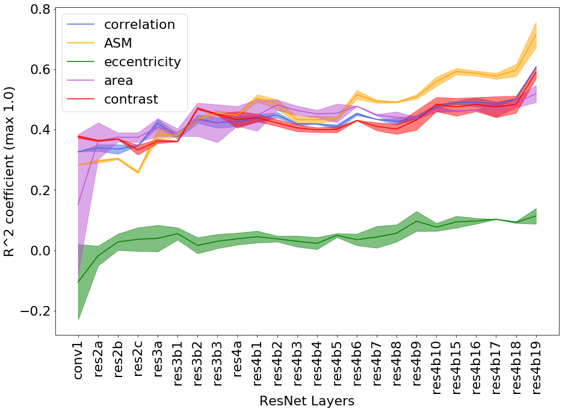
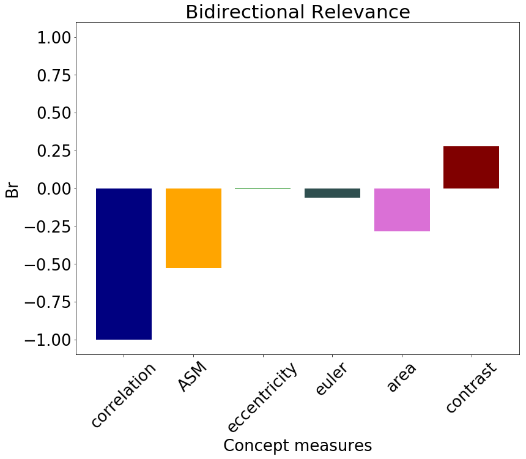

# Regression Concept Vectors for Bidirectional Explanations in Histopathology (iMIMIC at MICCAI 2018)
Mara Graziani, Vincent Andrearczyk, Henning Muller.

To be presented at Interpretability of Machine Intelligence in Medical Image Computing at MICCAI 2018.

Paper Preview:

This repository contains the code for implementing Regression Concept Vectors and Bidirectional Relevance scores, which were used to obtain the results presented in the paper.

## Dependencies
This code runs in Python >= 2.7.
Keras >= 2.1 and Tensorflow (>= 1.4) backend.

## Usage
This repository contains a jupyter notebook and the link to the necessary data and trained models to replicate the results. Please open the notebook RCV_notebook.ipynb for more information.

## Summary
Recent work on Testing with Concept Activation
Vectors (TCAV) proposed directional derivatives to quantify the in
uence of user-defined concepts on the network output [1]. However, diagnostic
concepts are often continuous measures that might be counter intuitive
to describe by their presence or absence.
In this paper, we extend TCAV from a classification problem to a regression
problem by computing Regression Concept Vectors (RCVs). Instead of seeking
a discriminator between two concepts, we
seek the direction of greatest increase of the measures for a single continuous
concept. We measure the relevance of a concept
with bidirectional relevance scores, Br. The Br scores assume positive values
when increasing values of the concept measures positively affect classification
and negative in the opposite case.

## Results

#### Correlation Analysis
As a prior analysis, we compute the Pearson product-moment correlation coefficient between the concept measures and the network prediction for a set of patches. More information about the Correlation Analysis and the concept measures used can be found in the paper.

|     | correlation | ASM | eccentricity | Euler | area | contrast |
| --- | ----------- | --- | ------------ | ----- | ---- | -------- |
r |-0.2285 | -0.1869 | -0.1460 | 0.1534| 0.2820 | 0.4119|
p-value |0.001 |0.001 | 0.01 |0.001 |0.001 |0.001|

#### Are we learning the concepts?

The performance of the linear regression was
computed for all the patches over
multiple reruns to check if the network is learning the concepts and in which layers.
The learning of the concepts across layers is linked to the size of the
receptive field of the neurons and the increasing complexity of the sought patterns.
Hence, more abstract concepts, potentially useful in other applications, can be learned and analyzed in deep layers of the network.

    

#### Bidirectional Relevance Scores
Br scores were formulated by taking into
account the principles of explanation continuity and selectivity proposed in [2].
For the former, we consider whether the sensitivity scores are similar for similar
data samples. For the latter, we redistribute the final relevance to concepts with
the strongest impact on the decision function. More details about the definition of Br scores are reported in the paper.

    

## Further applications
We applied RCVs to eye data. See this repository for more details.

## Relevant Research
 * [1] Interpretability Beyond Feature Attribution: Quantitative Testing with Concept Activation Vectors (https://arxiv.org/abs/1711.11279; Kim, B. et al https://github.com/tensorflow/tcav/blob/master/README.md)
 * [2] Methods for interpreting and understanding deep neural networks. Montavon, G. et al

## Installation

Clone the repository
Download the model weights (tumor_classifier.h5) in /models/0528-1559/ from: https://www.dropbox.com/sh/a56pyl4i8oj9zl9/AADR74UXUu_uZA6Omb3B9Q1Ea?dl=0
For resnet101 download the pretrained imagenet weights (store in scripts/models/imagenet_weights) from: https://drive.google.com/file/d/0Byy2AcGyEVxfTmRRVmpGWDczaXM/view

Download a subsample of the preprocessed Camelyon data (store in /data/camelyon17/) from: https://github.com/medgift/PROCESS_UC1/blob/master/data/intermediate_datasets/cam17/patches.hdf5

To install the list of dependencies run:

    pip install -r requirements.txt

To Run in Anaconda virtual environment (recommended):

    conda create -n venv pip python=3.5
    source activate venv
    pip install -r requirements.txt

Note: install tensorflow-gpu for gpu otpimization

## Credits

RCVs were computed by extending the keras-vis library: https://github.com/raghakot/keras-vis.

Staining normalization was performed thanks to the StainTools library: https://github.com/Peter554/StainTools.git.
